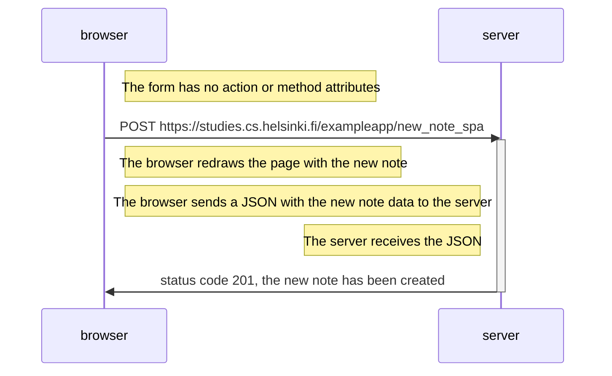

```mermaid
sequenceDiagram
    participant browser
    participant server

    Note right of browser: The form has no action or method attributes

    browser->>server: POST https://studies.cs.helsinki.fi/exampleapp/new_note_spa
    activate server
    Note right of browser: The browser redraws the page with the new note
    Note right of browser: The browser sends a JSON with the new note data to the server
    Note left of server: The server receives the JSON
    server->>browser: status code 201, the new note has been created
    deactivate server

```